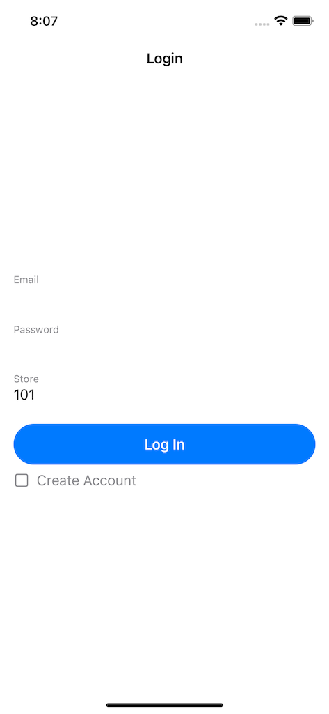
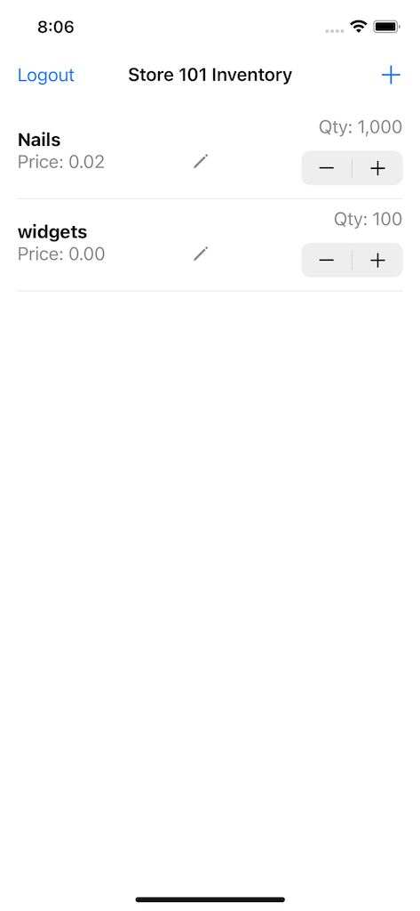
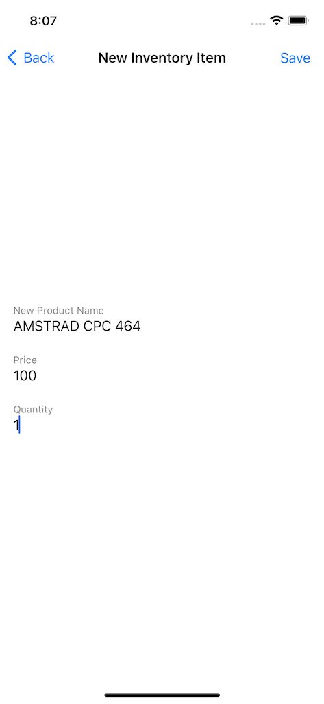

# Inventory Demo - SwiftUI

| Login       | Inventory List     | Adding an item     |
| :-------------: | :----------: | :-----------: |
|   |    |     |

## About

This is the SwiftUI version of the Inventory demo app. There are [other versions too](https://github.com/mongodb-developer/realm-demos/tree/main/inventory#mobile-clients).

## How to build

1. You need to clone this repo `git clone https://github.com/mongodb-developer/realm-demos/`
1. Go to the `ios-swiftui` folder: `cd inventory/clients/ios-swiftui/InventoryDemo`
1. Open the project file with Xcode: `InventoryDemo.xcodeproj`
1. Let Swift Package Manager resolve and download all dependencies
1. Select `InventoryDemo` [Scheme](#Schemes)
1. Before running, [change the Realm ID in `realm-app-id.txt`](#changing-the-realm-app-id)
1. Build and Run

## Schemes


This project has two Schemes:
- CI: used for Continuous Integration. In this case, a GitHub action is used to build the app. You can check the [workflow here](https://github.com/mongodb-developer/realm-demos/actions/workflows/build.yml)
- InventoryDemo: scheme used to run the app locally in Simulator, Device, etc.

## Changing the Realm App Id

This SwiftUI client uses Realm Sync to store data in the cloud. To do this, the client needs to know the Realm App ID. [Follow the instructions here to set up Realm Sync and get the Realm App ID.](https://github.com/mongodb-developer/realm-demos/tree/main/inventory#-create-an-atlas-cluster)

To set the Realm App ID in the mobile app code, create a new file named `realm-app-id.txt` in `realm-demos/inventory/clients/ios-swiftui/InventoryDemo`. Paste the Realm App ID in the file and save it.

## Tests

There are a few tests:
- Unit Tests
- Tests of SwiftUI
- UI Automation Tests

To run the tests from Xcode: ⌘ + U

### Running tests from the Command Line

If tests were working then something like this should work:

```
xcodebuild -project InventoryDemo.xcodeproj -scheme "ci" -sdk iphonesimulator -destination 'platform=iOS Simulator,name=iPhone 12 Pro Max,OS=14.5' -derivedDataPath './output' test
```
