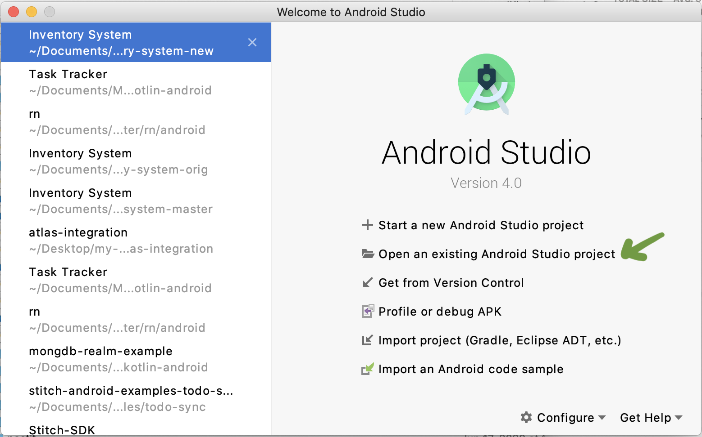
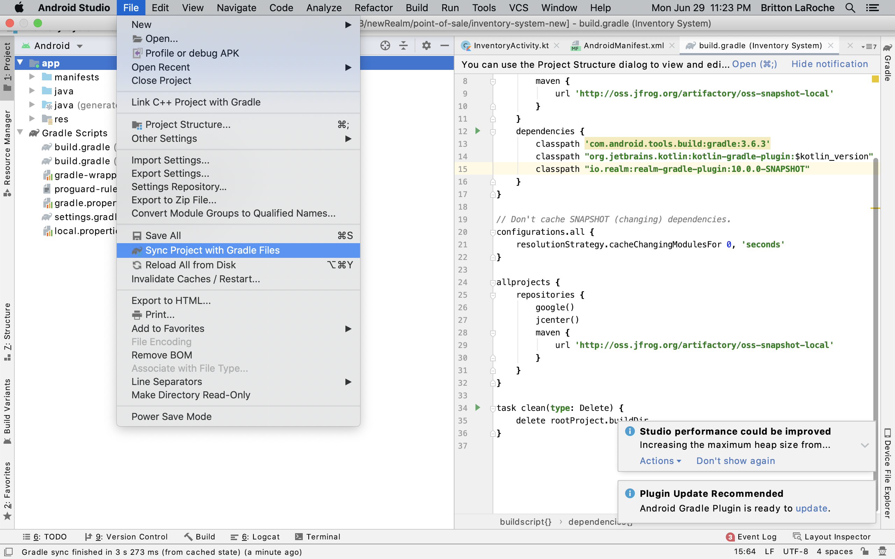

# Inventory Demo

[](https://www.apache.org/licenses/LICENSE-2.0)

This repo contains a simple Inventory tracking app for iOS and Android that can synchronise your Inventory Items between devices via Realm sync to our Atlas Server.

Checkout the README.md in each directory!

# License

Distributed under the Apache license. See ``LICENSE`` for more information.

# Welcome to the Realm Inventory Demo.   

## Overview:
This demo has three distinct parts that interact to show end to end functionality of Realm and Atlas with other systems.  

- __sync:__ consits of a mobile demo with syncronized access to Atlas data.  
- __backOffice__ takes advantage of Atlas integration with serverless functions and triggers that interact with REST, Kafka and Twilio.   
- __html__ is a Realm hosted application written with dymanic HTML and the browser SDK to act as an admin console showing inventory items across all stores.

This documentation is focused on helping you install and confiure the Realm Demo.  Special thanks to __Nate Cotino__ for creating the Realm Android mobile application written in Kotlin with Android studio.  Also special thanks to __Chris Grabosky__ who created a great GraphQL tutorial on how to connect to Atlas and use GraphQL.  Both of their githubs are linked below and will be used as part of this demo.

https://github.com/nathan-contino-mongo/inventory-system   
https://github.com/graboskyc/MongoDBStitchGraphQL   

This project integrated mobile devices with an Atlas cluster and allows for seamless syncroniaztion of mobile data with the MongoDB Atlas database running in the cloud.  Additionally it shows how to use realm functions and triggers to integrate with other cloud poviders and tools such as Kafka running in the Confluent Cloud, or being able to send an SMS message through twilio to any mobile device.  This demonstration shows how to create rest, and GraphQL endpoints for integration with business to business  or business to customer consumers allowing third party applications to query data stored in Atlas across all mobile devices.  As data is changed in Atlas it is automatically sycnronized with the mobile devices.

We show how all the pieces fit together in the Orthoginal Diagram below.

## Diagram


## Philosophy   
We believe that there is power in simpliclicity.  We did not include any frameworks and kept to a minimalist "hand rolled" design to showcase functionality.  To that end when forced to make a choice on a mobile development platform we chose Android Kotlin as we felt it was the easiest for a new developer to work with. [The MongoDB Realm Documentation](https://docs.mongodb.com/realm/) has great tutorials on getting started with React Native, and IOS as well as other development platforms.


##  Create an Atlas Cluster
Our first step is to create an atlas cluster. In our example we wont be able to create a free tier cluster known as an M0. The reason is that Realm Sync requires MongoDB version 4.4 and it is not available on the free tier at this time (2020-06-30).  Click the following link https://cloud.mongodb.com to sign up. Additional instructions on creating an Atlas cluster are available here: [Atlas getting started Guide](https://docs.atlas.mongodb.com/getting-started/)  

##  Configure the RealmSync Project   
We will now import the realm sync project.

##  Set up the mobile development environment  

#### 3.0. Install Android Studio  
The first step to start developing Android Apps is to download Android Studio 4.0 (minimum required version is 4.0) [here](https://developer.android.com/studio). 

#### 3.1. Download the Android Inventory project from github  
Once you have installed Android Studio you will need to download and install the mobile application from this github: https://github.com/nathan-contino-mongo/inventory-system

Move the zip file to the folder of your choice. Double click the zip file and unzip the contents. Open android studio.  

#### 3.2. Open the Inventory project 
    

When android opens a small popup window opens.  Select the "Open Existing Project" open the folder where you installed the zip file /inventory-system-master.  

#### 3.3. Syncronize the Gradle Scripts 
The project will load and a small staus window will ask you to syncronize the gradle files.  Chose the options to syncronize.  If you miss the prompt you can select File / Sync Project with Gradle Files.

    

#### 3.4. Set the AppId 
On the left hand navigation pane and expand the __Gradle Scripts__ and select the build.gradle(Module: app) file.  Find the appId variable and set it to the realm sync project AppId configured in step 2.

   

#### 3.4. Install Andoid SDK 10.0 API Level 29 
Ah the sheer joy of working with android mobile apps begins with the all the dependencies.  Now we need to download the andoroid sdk 10.0 API level 29.  Incase you missed the subtle prompt at the bottom right to install the SDK 10 API Level 29, and you did not click to install, you have another option by going to the menu bar and selecting __Tools > SDK Manager__   

  
 
After the SDK 10.0 with API level 29 has installed you will notice that the build has begun.  You can click the build tab at the lower left to see it running.

#### 3.5. Install Andoid Virtual Devices
The final step is to download at least 3 different android virtual devices.  I prefer a Galaxy, Nexus and a Pixel.  The AVD's can be managed and downlaoded from the AVD Manager located in the main menu under __Tools > AVD Manager__

  


##  Import the "Back Office" application

#### 4.0. Download the realm github repository
Begin by downlaoding the zip file or performing a check out of the [realm inventory application in this github](https://github.com/brittonlaroche/realm) The easiest method is to select the green clone button and download a zip file.  Take the zip file and unzip it in a directory of your choice.

The following section shows how to import the application via this GitHub and the stitch command line tool __"stitch-cli"__. Knowledge of how the stitch command line works is important as you can integrate stitch-cli with your CICD (continuous integration and continuous delivery) tools.  This allows you to work in your native development enviroment, commit changes to GitHub and then deploy and test as you would normally through your CICD work flow. [Stitch Command Line Blog Overview](https://www.mongodb.com/blog/post/mongodb-stitch-command-line-interface)


#### 4.1. Install the stitch-cli tool
Begin by [Installing the Stitch Command Line Interface tool](https://docs.mongodb.com/stitch/import-export/stitch-cli-reference/)

#### 4.2. Creat a project API key
Next [Create a Project API key](https://docs.atlas.mongodb.com/configure-api-access/#programmatic-api-keys).  When you createthe API key be sure to give yourself the __"Project Owner"__ role as you will need this to import the stitch application.   

Right click this link [Create a Project API key](https://docs.atlas.mongodb.com/configure-api-access/#programmatic-api-keys) open in new tab. Follow intrsuction under __Manage Programmatic Access to a Project__ perform each step listed in the section __Create an API Key for a Project__ be sure to copy the private API key somewhere safe for future refence.

#### 4.3. Log in via stitch-cli
log into your atlas cluster with your API key (public and private keys) with the stich command line tool.

Sample login instructions:
```
stitch-cli login --api-key=my-api-key --private-api-key=my-private-api-key
```

Example login (Don't worry its not a real api key):
```
stitch-cli login --api-key=ytqictxq --private-api-key=8137b118-4a36-4197-a3c7-23b73ba49775
←[0;0myou have successfully logged in as ytqictxq←[0m
```

#### 4.4 Import the inventory back office application
After logging in the command line maintains the connection until you execute the command __stitch-cli logout__.  We are now ready to import the application. The following command below should work.  Navigate to the folder where you unziped the realm git hub zip file in step 4.0. 
```
stitch-cli import --path=./realm-master/inventoryDemo/export/backOffice --strategy=replace
```

Follow the prompts and respond __y__ when asked if you would like to create a new app. Press enter to accept the default values.  Change the values to match your configuration.  An example is provided below.

```
stitch-cli import \path=./realm-master/inventoryDemo/export/backOffice --strategy=replace
←[0;0mUnable to find app with ID: "invnetory-ekqoy": would you like to create a new app? [y/n]:←[0m y
←[0;0mApp name [inventory]:←[0m
←[0;0mAvailable Projects:←[0m
←[0;0mProject 0 - 5ce58a9fc56c98145d922e93←[0m
←[0;0mAtlas Project Name or ID [Project 0]:←[0m
←[0;0mLocation [US-VA]:←[0m
←[0;0mDeployment Model [GLOBAL]:←[0m
←[0;0mNew app created: inventory-vibtf←[0m
←[0;0mImporting app...←[0m
←[0;0mDone.←[0m
←[0;0mSuccessfully imported 'inventory-vibtf'←[0m

stitch-cli logout

```

If you named your cluster anything other than the default __"Cluster0"__ then you will need to modify a json document to reflect your cluster name. The document is located in your directory here: /realm-master/inventoryDemo/export/backOffice/services/mongodb-atlas/config.json

If you named your cluster "DevCluster" for example you would change the __"clusterName":__ field from __"Cluster0"__ to __"DevCluster"__.  An example has been provided below.

```

{
    "id": "5d218cb4e0601bec3de065c7",
    "name": "mongodb-atlas",
    "type": "mongodb-atlas",
    "config": {
        "clusterName": "DevCluster",
        "readPreference": "primary",
        "wireProtocolEnabled": false
    },
    "version": 1
}
```
Once you save your changes you are ready to try the import again.

##   Host the HTML
